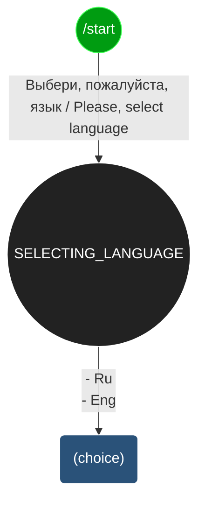

# Telegram-бот для продаж сертификатов впечатлений

Проект представляет Telegram-бота для продаж сертификатов впечатлений.

## Как установить

Для запуска бота нужен Python версии 3.8+.

Скачайте код c Github. Создайте виртуальное окружение и активируйте его:

В Windows:
```ssh
python -m venv venv
venv\Scripts\activate
```

В Linux:
```ssh
python3 -m venv venv
source venv/bin/activate
```

Установите зависимости:

В Windows:
```ssh
pip install -r requirements.txt
```

В Linux:
```ssh
pip3 install -r requirements.txt
```

## Переменные окружения

Часть настроек утилит берётся из переменных окружения. Чтобы их определить, создайте файл `.env` в той же папке, где и скрипты, и запишите туда данные в таком формате: `ПЕРЕМЕННАЯ=значение`.

Доступна следующая обязательная переменная окружения:

- `TELEGRAM_BOT_TOKEN` - API-токен Telegram-бота. Если такого telegram-бота пока нет, [создайте его](https://way23.ru/регистрация-бота-в-telegram.html).

Пример содержимого файла .env:
```
#
TELEGRAM_BOT_TOKEN=958423683:AAEAtJ5Lde5YYfkjergber
```

## Как запустить

Для запуска бота откройте консоль `cmd` в Windows или терминал в Linux и наберите в командной строке команду:

В Windows:
```ssh
python bot.py
```

В Linux:
```ssh
python3 bot.py
```

## Схема чат-бота



## Цель проекта

Код написан для реального заказа на фрилансе.
